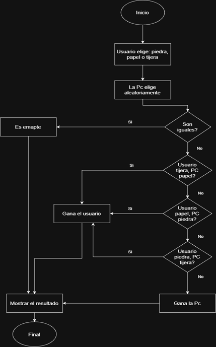
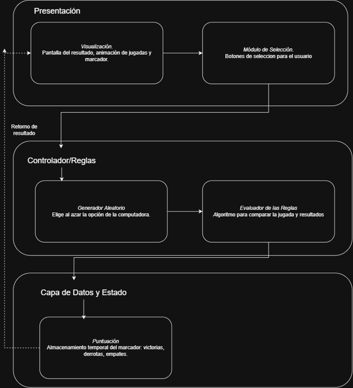

# Juego Piedra, Papel o Tijera - Python (UIDE)

Proyecto desarrollado para la asignatura de Logica de Programación. Consiste en una aplicación de consola en Python que implementa las reglas tradicionales de Piedra, Papel o Tijera con validación de entradas, control de flujo y contador de marcador acumulado.

## Diagramas del Sistema

### Diagrama 1: Diagrama de Flujo


### Diagrama 2: Arquitectura y Capas del Sistema


## Instrucciones de Ejecución
1. Abrir la terminal en la carpeta del proyecto.
2. Ejecutar el comando:
   ```bash
   python juego.py
